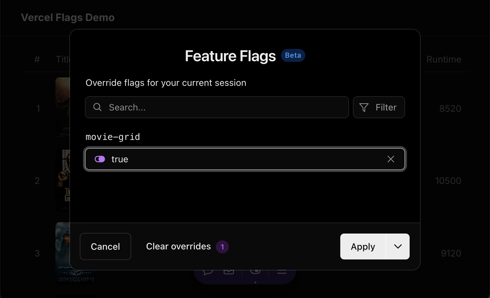

# Vercel Flags Demo

You must copy the `.env.example` file to `.env.local` and set the correct
environment variables before running the app.

### Screenshot with the "movie-grid" flag disabled

### Turn on the "movie-grid" flag using Vercel Toolbar

### Screenshot with the "movie-grid" flag enabled

